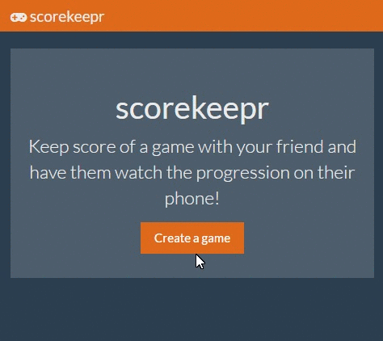
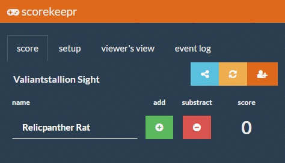

# scorekeepr

This application will help you share and keep the score of any game where you have to add or substract points. Originally, I made this app for the card game [Release!](http://inedo.com/release), but I decided to generalise it a bit as it can be useful for any kind of game (e.g.: Scrabble, random hockey game, anything where you need to add and substract points from player or teams, really).

  <!-- Dependency Status -->
  
  <!-- devDependency Status -->
  
  <!-- Build Status -->
  
  <!-- Test Coverage -->
  

Want to [contibute](.github/CONTRIBUTING.md)?

# demo

## easy to use

## simple calc syntax!

# documentation

* [IDEAS](.docs/IDEAS.md)
* [STRUCTURE](.docs/STRUCTURE.md)
* [QUESTIONS](.docs/QUESTIONS.md)
